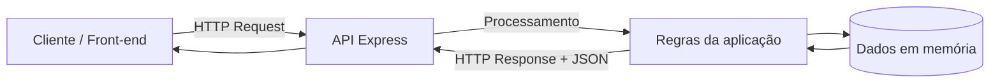

# Sistema de Gestão de Doações FMP - API Back-end

API Back-end do Projeto Integrador, desenvolvida com **Node.js** e **Express**, criada para fornecer e receber dados do sistema de gestão de doações desenvolvido pelo grupo.

> **Etapa atual:** início da API Back-end do Projeto Integrador.
>
> Nesta etapa, o objetivo é estruturar o servidor, implementar os primeiros endpoints HTTP e estabelecer um fluxo de desenvolvimento colaborativo utilizando Git e GitHub. A API ainda não representa a versão final do sistema.

---

## 📌 Sobre o projeto

O **Sistema de Gestão de Doações FMP** tem como finalidade organizar informações relacionadas a doações, permitindo que os dados sejam futuramente utilizados pelo front-end do projeto integrador.

Nesta primeira etapa do Back-end, foi criada uma API REST inicial capaz de:

- verificar se o servidor está funcionando;
- listar doações cadastradas;
- buscar uma doação específica pelo seu ID;
- cadastrar novas doações;
- retornar códigos de status HTTP de acordo com o resultado de cada operação;
- disponibilizar uma estrutura inicial para futuras integrações com banco de dados e outras funcionalidades.

Atualmente, os registros utilizados pela API são mantidos **em memória**, dentro do próprio servidor. Portanto, os dados não são persistidos após o encerramento da aplicação.

---

## 👥 Integrantes do grupo

| Integrante |
|---|
| Davi Aravechia |
| Eduardo Silva |
| Lucas Alexandre Vieira Schutz |
| Vitor |

---

## 🧰 Tecnologias utilizadas

| Tecnologia | Função no projeto |
|---|---|
| **Node.js** | Ambiente responsável pela execução do JavaScript no Back-end |
| **Express** | Framework utilizado para criação do servidor e das rotas HTTP |
| **NPM** | Gerenciamento do projeto e das dependências |
| **JavaScript** | Linguagem utilizada na implementação da API |
| **Git** | Controle de versão do código |
| **GitHub** | Hospedagem do repositório e colaboração entre os integrantes |

---

## 🏗️ Arquitetura utilizada

A aplicação segue o modelo básico de **arquitetura cliente-servidor**.



### Fluxo básico

1. O cliente realiza uma requisição HTTP para um endpoint da API.
2. O Express identifica a rota e o método HTTP utilizado.
3. O servidor processa a requisição.
4. A aplicação consulta ou altera os dados mantidos em memória.
5. O servidor devolve uma resposta HTTP, normalmente no formato JSON.

Essa estrutura permite que o front-end e o back-end trabalhem separados, comunicando-se por meio de requisições HTTP.

---

## 🌐 HTTP e endpoints

A API utiliza os principais conceitos do protocolo HTTP para definir as operações disponíveis.

| Verbo | Utilização geral | Utilização nesta etapa |
|---|---|---|
| **GET** | Consultar dados | Listar e buscar doações |
| **POST** | Criar/enviar dados | Cadastrar uma nova doação |
| **PUT** | Atualizar dados | Ainda não implementado |
| **DELETE** | Remover dados | Ainda não implementado |

### O que é um endpoint?

Um endpoint é um endereço específico da API utilizado para realizar uma determinada operação.

Exemplo:

```text
GET /api/doacoes
```

Nesse caso:

- `GET` representa o método HTTP;
- `/api/doacoes` representa o caminho do endpoint;
- o servidor recebe a requisição e retorna os dados correspondentes.

---

# 🚀 Como executar o projeto

## Pré-requisitos

É necessário ter instalado:

- **Node.js**
- **NPM**, normalmente instalado junto com o Node.js
- **Git**, caso o projeto seja obtido pelo repositório

---

## 1. Clonar o repositório

```bash
git clone https://github.com/DaviAravechiaFMP/sistemaDeDoacoesBack.git
```

Depois, entre na pasta do projeto:

```bash
cd sistemaDeDoacoesBack
```

---

## 2. Instalar as dependências

Execute:

```bash
npm install
```

Esse comando instala as dependências especificadas no `package.json`, incluindo o Express.

---

## 3. Iniciar o servidor

Execute:

```bash
npm start
```

O servidor será iniciado na porta **3000**.

Mensagem esperada no terminal:

```text
Servidor rodando em http://localhost:3000
```

Com o servidor ativo, a API poderá ser acessada por:

```text
http://localhost:3000
```

---

# 📁 Estrutura atual do projeto

```text
sistemaDeDoacoesBack/
├── node_modules/
├── package.json
├── package-lock.json
├── README.md
└── server.js
```

### Principais arquivos

**`server.js`**

Arquivo principal da aplicação. É responsável por:

- importar o Express;
- criar a aplicação;
- habilitar o recebimento de JSON;
- armazenar temporariamente as doações;
- definir os endpoints;
- realizar validações básicas;
- retornar os códigos de status HTTP;
- iniciar o servidor na porta 3000.

**`package.json`**

Arquivo de configuração do projeto Node.js, contendo informações do projeto, scripts de execução e dependências.

**`README.md`**

Documentação da API, contendo instruções de execução, endpoints e exemplos de utilização.

---

# 🔌 Endpoints disponíveis

## Visão geral

| Método | Endpoint | Descrição | Status esperados |
|---|---|---|---|
| `GET` | `/` | Verifica se a API está funcionando | `200` |
| `GET` | `/api/doacoes` | Lista todas as doações | `200` |
| `GET` | `/api/doacoes/:id` | Busca uma doação pelo ID | `200` / `404` |
| `POST` | `/api/doacoes` | Cadastra uma nova doação | `201` / `400` |

---

## 1. GET `/`

### Finalidade

Endpoint utilizado para verificar se o servidor está ativo e respondendo às requisições.

### Requisição

```http
GET /
```

### Resposta de sucesso

**Status:** `200 OK`

```json
{
  "mensagem": "API do Sistema de Doações funcionando"
}
```

---

## 2. GET `/api/doacoes`

### Finalidade

Retorna todas as doações atualmente armazenadas em memória.

### Requisição

```http
GET /api/doacoes
```

### Resposta de sucesso

**Status:** `200 OK`

Exemplo:

```json
[
  {
    "id": 1,
    "doador": "Maria Silva",
    "item": "Cesta básica",
    "quantidade": 2,
    "status": "recebida"
  },
  {
    "id": 2,
    "doador": "João Souza",
    "item": "Cobertor",
    "quantidade": 5,
    "status": "pendente"
  }
]
```

---

## 3. GET `/api/doacoes/:id`

### Finalidade

Busca uma única doação a partir do seu identificador (`id`).

### Parâmetro de rota

| Parâmetro | Tipo | Descrição |
|---|---|---|
| `id` | Número | Identificador da doação que será buscada |

### Exemplo de requisição

```http
GET /api/doacoes/1
```

### Resposta quando a doação existe

**Status:** `200 OK`

```json
{
  "id": 1,
  "doador": "Maria Silva",
  "item": "Cesta básica",
  "quantidade": 2,
  "status": "recebida"
}
```

### Resposta quando a doação não existe

**Status:** `404 Not Found`

```json
{
  "erro": "Doação não encontrada"
}
```

---

## 4. POST `/api/doacoes`

### Finalidade

Cria e adiciona uma nova doação à lista mantida em memória.

### Requisição

```http
POST /api/doacoes
Content-Type: application/json
```

### Corpo esperado

O corpo da requisição deve possuir:

| Campo | Tipo esperado | Obrigatório | Regra |
|---|---|---|---|
| `doador` | Texto | Sim | Deve ser informado |
| `item` | Texto | Sim | Deve ser informado |
| `quantidade` | Número | Sim | Deve ser maior que `0` |

### Exemplo de corpo

```json
{
  "doador": "Ana Costa",
  "item": "Agasalho",
  "quantidade": 3
}
```

### Resposta de sucesso

**Status:** `201 Created`

Exemplo:

```json
{
  "id": 3,
  "doador": "Ana Costa",
  "item": "Agasalho",
  "quantidade": 3,
  "status": "pendente"
}
```

### Resposta para dados inválidos

**Status:** `400 Bad Request`

Exemplo:

```json
{
  "erro": "Informe um doador, item e uma quantidade válida (maior que 0)."
}
```

---

# 📊 Códigos de status HTTP utilizados

A API utiliza os códigos de status para indicar o resultado do processamento da requisição.

| Código | Nome | Utilização no projeto |
|---|---|---|
| `200` | OK | Requisição realizada com sucesso |
| `201` | Created | Nova doação criada com sucesso |
| `400` | Bad Request | Dados enviados no POST são inválidos |
| `404` | Not Found | Doação ou rota solicitada não foi encontrada |

### Exemplo de interpretação

```text
GET /api/doacoes/1  → 200
GET /api/doacoes/999 → 404
POST /api/doacoes válido → 201
POST /api/doacoes inválido → 400
```

---

# 🧪 Exemplos de testes

Os endpoints podem ser testados pelo navegador, Postman ou outra ferramenta capaz de realizar requisições HTTP.

## Teste 1 — Verificar a API

Acesse:

```text
http://localhost:3000/
```

Resultado esperado: resposta JSON com a mensagem de funcionamento da API.

## Teste 2 — Listar doações

Acesse:

```text
http://localhost:3000/api/doacoes
```

Resultado esperado: lista de doações em formato JSON.

## Teste 3 — Buscar uma doação existente

Acesse:

```text
http://localhost:3000/api/doacoes/1
```

Resultado esperado: uma doação específica com status `200`.

## Teste 4 — Buscar uma doação inexistente

Acesse:

```text
http://localhost:3000/api/doacoes/999
```

Resultado esperado: erro em JSON com status `404`.

## Teste 5 — Criar uma doação

No Postman, selecione:

```text
POST http://localhost:3000/api/doacoes
```

Em **Body → raw → JSON**, utilize:

```json
{
  "doador": "Ana Costa",
  "item": "Agasalho",
  "quantidade": 3
}
```

Resultado esperado: nova doação criada com status `201`.

---

# ✅ Validações implementadas no POST

Antes de cadastrar uma doação, a API verifica se:

- o campo `doador` foi informado;
- o campo `item` foi informado;
- o campo `quantidade` foi informado;
- a quantidade é maior que zero.

Quando alguma dessas condições não é atendida, a API interrompe o cadastro e retorna:

```http
400 Bad Request
```

com uma mensagem de erro em JSON.

---

# 💾 Armazenamento dos dados

Nesta versão, as doações são armazenadas em uma estrutura de dados **em memória** no arquivo `server.js`.

Isso significa que:

- os dados podem ser consultados enquanto o servidor estiver executando;
- novas doações podem ser adicionadas durante a execução;
- os dados não são persistidos em um banco de dados;
- ao reiniciar o servidor, os dados cadastrados anteriormente deixam de existir.

Essa implementação é intencional para a etapa inicial do desenvolvimento. A integração com banco de dados poderá ser realizada nas próximas etapas do Projeto Integrador.

---

# 🔄 Funcionamento do cadastro de uma doação

O fluxo simplificado do endpoint `POST /api/doacoes` é:

```text
Cliente
   │
   │ POST /api/doacoes
   │ + JSON
   ▼
Express
   │
   │ Validação dos campos
   ▼
Dados válidos?
   ├── Não ──► 400 Bad Request
   │
   └── Sim
        │
        ▼
   Geração do ID
        │
        ▼
   Cadastro em memória
        │
        ▼
   201 Created
```

---

# 🧩 Organização das rotas

As rotas foram organizadas seguindo o recurso principal da aplicação:

```text
/api/doacoes
```

A partir desse recurso, foram implementadas operações de consulta e criação:

```text
GET  /api/doacoes
GET  /api/doacoes/:id
POST /api/doacoes
```

Essa organização facilita a evolução futura da API para novas operações, como atualização e exclusão de registros.

---

# 🔐 Tratamento de rotas inexistentes

Além dos endpoints principais, a aplicação possui um tratamento para requisições direcionadas a caminhos que não foram definidos.

Exemplo:

```http
GET /api/rota-que-nao-existe
```

Resposta:

**Status:** `404 Not Found`

```json
{
  "erro": "Rota não encontrada"
}
```

---

# 🌱 Evolução prevista do projeto

Como esta é a etapa inicial do Back-end, novas funcionalidades poderão ser adicionadas posteriormente. Entre as possibilidades de evolução estão:

- integração com banco de dados;
- persistência das doações;
- atualização de registros com `PUT`;
- remoção de registros com `DELETE`;
- novas validações de entrada;
- integração completa com o front-end;
- criação de novos recursos relacionados ao sistema de doações.

> Essas funcionalidades **não fazem parte da implementação desta etapa** e são apresentadas apenas como possíveis evoluções do projeto.

---

# 🌿 Versionamento e colaboração

O projeto utiliza **Git e GitHub** para controle de versão e desenvolvimento colaborativo.

A colaboração permite registrar o histórico das alterações e identificar as contribuições de cada integrante do grupo.

## Fluxo básico de contribuição

```bash
git pull
git add .
git commit -m "Descrição da alteração"
git push
```

Antes do commit, cada integrante deve utilizar sua própria identidade configurada no Git para que sua contribuição apareça corretamente no histórico do repositório.

### Regra da atividade

Cada integrante do grupo deve realizar **pelo menos um commit com a própria conta do GitHub**, de modo que os nomes dos integrantes possam ser identificados no histórico do projeto.

---

# 📦 Repositório

Repositório público do projeto:

**https://github.com/DaviAravechiaFMP/sistemaDeDoacoesBack**

---

# 📚 Relação com os conteúdos estudados

Esta etapa aplica os conceitos estudados na introdução ao Back-end:

| Conteúdo | Aplicação no projeto |
|---|---|
| Back-end | Servidor responsável pelo processamento das requisições |
| Cliente-servidor | Comunicação entre cliente e API |
| HTTP | Protocolo utilizado na comunicação |
| GET | Consulta das doações |
| POST | Cadastro de novas doações |
| Endpoints | Endereços das operações da API |
| Node.js | Execução do JavaScript no servidor |
| Express | Criação do servidor e definição das rotas |
| NPM | Instalação e gerenciamento das dependências |
| Status codes | Indicação do resultado das requisições |
| JSON | Formato utilizado nas respostas e no corpo do POST |
| Git/GitHub | Versionamento e colaboração |

---

# 📝 Status atual

**API inicial do Projeto Integrador — em desenvolvimento.**

### Implementado nesta etapa

- [x] Estrutura inicial Node.js/NPM
- [x] Express configurado
- [x] Servidor HTTP na porta 3000
- [x] Rota de verificação da API
- [x] `GET /api/doacoes`
- [x] `GET /api/doacoes/:id`
- [x] `POST /api/doacoes`
- [x] Status codes `200`, `201`, `400` e `404`
- [x] Validação básica dos dados recebidos no POST
- [x] Tratamento de rota inexistente
- [x] Documentação inicial dos endpoints
- [x] Versionamento utilizando Git e GitHub

### Ainda não implementado nesta etapa

- [ ] Banco de dados persistente
- [ ] `PUT`
- [ ] `DELETE`
- [ ] Autenticação e autorização
- [ ] Integração completa com todas as funcionalidades do front-end

---

## 📄 Observação sobre o projeto

Este é um projeto acadêmico desenvolvido para o **Projeto Integrador da FMP**. Até o momento, o projeto não define uma licença de software específica.
