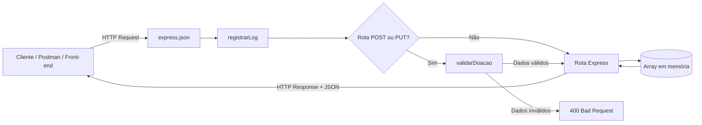

# 🤝 Sistema de Gestão de Doações FMP — API Back-end (v2)

API REST do **Projeto Integrador**, desenvolvida com **Node.js** e **Express**, responsável por fornecer e receber os dados do sistema de gestão de doações criado pelo grupo.

> **Etapa atual (v2):** CRUD completo em memória, middlewares de log e validação, variáveis de ambiente com `.env`, reinício automático com Nodemon e status codes HTTP corretos.

---

## 📑 Sumário

- [Sobre o projeto](#-sobre-o-projeto)
- [Integrantes do grupo](#-integrantes-do-grupo)
- [O que mudou da v1 para a v2](#-o-que-mudou-da-v1-para-a-v2)
- [Tecnologias utilizadas](#-tecnologias-utilizadas)
- [Arquitetura](#-arquitetura)
- [Como executar](#-como-executar)
- [Estrutura do projeto](#-estrutura-do-projeto)
- [Endpoints](#-endpoints)
- [Middlewares](#-middlewares)
- [Testes no Postman](#-testes-no-postman)
- [Limitações conhecidas](#-limitações-conhecidas)
- [Próximos passos](#-próximos-passos)

---

## 📌 Sobre o projeto

O **Sistema de Gestão de Doações FMP** organiza informações sobre doações (quem doou, o que foi doado, quantidade e situação), permitindo que esses dados sejam consumidos pelo front-end do Projeto Integrador.

Esta API oferece:

- Rota de verificação do servidor;
- CRUD completo de doações (listar, buscar por ID, cadastrar, atualizar e remover);
- Middlewares globais de **log** e de **validação** de dados;
- Respostas com status codes apropriados (`200`, `201`, `400`, `404`);
- Configurações protegidas em arquivo `.env`;
- Ambiente de desenvolvimento com reinício automático (Nodemon).

> ⚠️ Os dados ficam **em memória** (um array dentro do servidor). Ao reiniciar ou encerrar a aplicação, tudo volta ao estado inicial. O banco de dados real entra nas próximas etapas.

---

## 👥 Integrantes do grupo

| Integrante |
|---|
| Davi Aravechia |
| Eduardo Silva |
| Lucas Alexandre Vieira Schutz |
| Vitor |

---

## 🔄 O que mudou da v1 para a v2

| Item | v1 | v2 |
|---|---|---|
| Execução | `node server.js` manual | `npm run dev` com **Nodemon** (reinicia ao salvar) |
| Configuração | Porta fixa no código | Porta em **`.env`** (`process.env.PORT`) |
| Segurança do repositório | — | **`.gitignore`** protege `.env` e `node_modules` |
| Rotas | Listar e cadastrar | **CRUD completo**, incluindo rotas com parâmetro (`/:id`) |
| Validação | Dentro das rotas | **Middleware** `validarDoacao` (POST e PUT) |
| Observabilidade | — | **Middleware de log** no terminal |
| Respostas | Sem padrão definido | Status codes corretos: `200`, `201`, `400`, `404` |
| Rotas inexistentes | Resposta padrão do Express | Middleware final com JSON `404` |

---

## 🧰 Tecnologias utilizadas

| Tecnologia | Função no projeto |
|---|---|
| **Node.js** | Executa o JavaScript no back-end |
| **Express** (v5) | Criação do servidor e das rotas HTTP |
| **Dotenv** | Leitura das variáveis de ambiente do `.env` |
| **Nodemon** | Reinício automático do servidor em desenvolvimento |
| **NPM** | Gerenciamento de dependências e scripts |
| **Git / GitHub** | Controle de versão e colaboração do grupo |
| **Postman** | Testes manuais das rotas |

---

## 🏗️ Arquitetura

A aplicação segue o modelo **cliente-servidor**. Toda requisição passa pelos middlewares antes de chegar à rota.


```mermaid
flowchart LR
    A[Cliente / Postman / Front-end] -->|HTTP Request| B[express.json]
    B --> C[registrarLog]
    C --> D{Rota POST ou PUT?}
    D -->|Sim| E[validarDoacao]
    D -->|Não| F[Rota Express]
    E -->|Dados válidos| F
    E -->|Dados inválidos| X[400 Bad Request]
    F --> G[(Array em memória)]
    G --> F
    F -->|HTTP Response + JSON| A
```

### Fluxo de uma requisição

1. O cliente envia uma requisição HTTP para um endpoint.
2. `express.json()` converte o corpo da requisição em objeto JavaScript (`req.body`).
3. `registrarLog` imprime no terminal o horário, o método e a URL.
4. Em **POST** e **PUT**, `validarDoacao` confere os dados enviados. Se algo estiver errado, responde `400` e a rota nem é executada.
5. A rota consulta ou altera o array em memória.
6. O servidor devolve o status code correto e o JSON de resposta.

### Verbos HTTP utilizados

| Verbo | Uso geral | Uso nesta API |
|---|---|---|
| `GET` | Consultar dados | Listar todas as doações e buscar uma por ID |
| `POST` | Criar dados | Cadastrar nova doação |
| `PUT` | Atualizar dados | Atualizar uma doação existente |
| `DELETE` | Remover dados | Remover uma doação pelo ID |

---

## 🚀 Como executar

### Pré-requisitos

- [Node.js](https://nodejs.org/) **18 ou superior**
- NPM (já vem com o Node.js)
- Git

### 1. Clonar o repositório

```bash
git clone https://github.com/DaviAravechiaFMP/sistemaDeDoacoesBack.git
cd sistemaDeDoacoesBack
```

### 2. Criar o arquivo `.env`

Na raiz do projeto, crie um arquivo chamado `.env` com:

```env
PORT=3000
```

> O `.env` está no `.gitignore` e **não deve ser enviado ao GitHub**. Se `PORT` não for definida, a API usa `3000` por padrão.

### 3. Instalar as dependências

```bash
npm install
```

### 4. Iniciar o servidor

**Desenvolvimento** (com Nodemon, reinicia ao salvar):

```bash
npm run dev
```

**Produção** (Node puro):

```bash
npm start
```

Mensagem esperada no terminal:

```text
Servidor rodando na porta 3000
```

A API ficará disponível em: **http://localhost:3000**

### Scripts disponíveis

| Comando | O que faz |
|---|---|
| `npm start` | Executa `node server.js` |
| `npm run dev` | Executa `nodemon server.js` |

---

## 📁 Estrutura do projeto

```text
sistemaDeDoacoesBack/
├── node_modules/
├── .env              <- Variáveis de ambiente (local, não vai ao GitHub)
├── .gitignore        <- Protege .env e node_modules
├── package.json      <- Scripts start/dev e dependências
├── package-lock.json
├── README.md         <- Documentação da API
└── server.js         <- Servidor Express, middlewares e rotas
```

---

## 🔌 Endpoints

### Visão geral

| Método | Endpoint | Descrição | Status possíveis |
|---|---|---|---|
| `GET` | `/` | Verifica se a API está no ar | `200` |
| `GET` | `/api/doacoes` | Lista todas as doações | `200` |
| `GET` | `/api/doacoes/:id` | Busca uma doação pelo ID | `200` / `404` |
| `POST` | `/api/doacoes` | Cadastra uma nova doação | `201` / `400` |
| `PUT` | `/api/doacoes/:id` | Atualiza uma doação existente | `200` / `400` / `404` |
| `DELETE` | `/api/doacoes/:id` | Remove uma doação | `200` / `404` |

### Modelo de dados

| Campo | Tipo | Descrição |
|---|---|---|
| `id` | Número | Gerado automaticamente pela API |
| `doador` | Texto | Nome de quem doou |
| `item` | Texto | O que foi doado |
| `quantidade` | Número | Quantidade doada (maior que 0) |
| `status` | Texto | `"pendente"` ao cadastrar (a API não altera esse campo no `PUT`) |

Dados iniciais carregados ao subir o servidor:

```json
[
  { "id": 1, "doador": "Maria Silva", "item": "Cesta básica", "quantidade": 2, "status": "recebida" },
  { "id": 2, "doador": "João Souza", "item": "Cobertor", "quantidade": 5, "status": "pendente" }
]
```

---

### 1. `GET /`

Verifica se a API está ativa.

**200 OK**

```json
{ "mensagem": "API do Sistema de Doações funcionando" }
```

### 2. `GET /api/doacoes`

Retorna todas as doações armazenadas.

**200 OK**

```json
[
  { "id": 1, "doador": "Maria Silva", "item": "Cesta básica", "quantidade": 2, "status": "recebida" },
  { "id": 2, "doador": "João Souza", "item": "Cobertor", "quantidade": 5, "status": "pendente" }
]
```

### 3. `GET /api/doacoes/:id`

Busca uma doação pelo ID (parâmetro de rota).

**200 OK**

```json
{ "id": 1, "doador": "Maria Silva", "item": "Cesta básica", "quantidade": 2, "status": "recebida" }
```

**404 Not Found**

```json
{ "mensagem": "Doação não encontrada" }
```

### 4. `POST /api/doacoes`

Cadastra uma nova doação. O `id` é o **maior ID existente + 1** e o `status` inicial é `"pendente"`.

**Corpo da requisição (JSON)**

| Campo | Tipo | Obrigatório | Regra |
|---|---|---|---|
| `doador` | Texto | Sim | Não pode ser vazio |
| `item` | Texto | Sim | Não pode ser vazio |
| `quantidade` | Número | Sim | Deve ser do tipo número e maior que 0 |

```json
{ "doador": "Ana Costa", "item": "Agasalho", "quantidade": 3 }
```

**201 Created**

```json
{ "id": 3, "doador": "Ana Costa", "item": "Agasalho", "quantidade": 3, "status": "pendente" }
```

**400 Bad Request** (exemplo)

```json
{ "mensagem": "A quantidade deve ser um número maior que 0" }
```

### 5. `PUT /api/doacoes/:id`

Atualiza `doador`, `item` e `quantidade` de uma doação existente. Usa as mesmas regras de validação do `POST`.

**Corpo da requisição (JSON)**

```json
{ "doador": "Maria Silva", "item": "Cesta básica completa", "quantidade": 4 }
```

**200 OK**

```json
{ "id": 1, "doador": "Maria Silva", "item": "Cesta básica completa", "quantidade": 4, "status": "recebida" }
```

**400 Bad Request**: corpo inválido (mesmas mensagens do `POST`).

**404 Not Found**

```json
{ "mensagem": "Doação não encontrada" }
```

### 6. `DELETE /api/doacoes/:id`

Remove uma doação pelo ID.

**200 OK**

```json
{ "mensagem": "Doação removida com sucesso" }
```

**404 Not Found**

```json
{ "mensagem": "Doação não encontrada" }
```

### Rotas inexistentes

Qualquer rota que não exista retorna:

**404 Not Found**

```json
{ "mensagem": "Rota não encontrada" }
```

### Mensagens de erro de validação (400)

| Situação | Mensagem retornada |
|---|---|
| Corpo da requisição ausente | `O corpo da requisição não pode estar vazio` |
| `doador` ausente ou vazio | `O doador é obrigatório` |
| `item` ausente ou vazio | `O item é obrigatório` |
| `quantidade` ausente, não numérica ou ≤ 0 | `A quantidade deve ser um número maior que 0` |

---

## 🛡️ Middlewares

| Middleware | Escopo | Função |
|---|---|---|
| `express.json()` | Global | Converte o corpo da requisição em JSON (sem ele, `req.body` fica `undefined`) |
| `registrarLog` | Global | Imprime no terminal horário, método HTTP e URL de cada requisição |
| `validarDoacao` | `POST` e `PUT` | Garante que `doador`, `item` e `quantidade` (número > 0) foram enviados corretamente |
| Fallback 404 | Final | Captura qualquer rota inexistente e responde `404` em JSON |

Exemplo de saída do log no terminal:

```text
[14:32:10] GET /api/doacoes
[14:32:25] POST /api/doacoes
```

> **Ordem importa:** os middlewares são registrados **antes** das rotas, e o fallback `404` fica **por último**. Todo middleware chama `next()` para liberar a requisição.

---

## 📊 Testes no Postman

Configure o corpo das requisições `POST` e `PUT` como **Body → raw → JSON**.

| # | Método | URL | Body (JSON) | Resposta esperada |
|---|---|---|---|---|
| 1 | `GET` | `http://localhost:3000/api/doacoes` | — | `200 OK` + lista completa |
| 2 | `GET` | `http://localhost:3000/api/doacoes/1` | — | `200 OK` + doação de id 1 |
| 3 | `GET` | `http://localhost:3000/api/doacoes/999` | — | `404 Not Found` |
| 4 | `POST` | `http://localhost:3000/api/doacoes` | `{"doador":"Ana","item":"Agasalho","quantidade":3}` | `201 Created` + objeto criado |
| 5 | `POST` | `http://localhost:3000/api/doacoes` | `{}` ou sem campo obrigatório | `400 Bad Request` (middleware) |
| 6 | `PUT` | `http://localhost:3000/api/doacoes/1` | `{"doador":"Maria","item":"Cesta Padrão","quantidade":5}` | `200 OK` + objeto atualizado |
| 7 | `DELETE` | `http://localhost:3000/api/doacoes/1` | — | `200 OK` + mensagem de remoção |

> O navegador só faz requisições `GET`. Use o Postman para `POST`, `PUT` e `DELETE`, e acompanhe o terminal para ver o middleware de log funcionando.

---

## ⚠️ Limitações conhecidas

- **Sem persistência:** os dados vivem em memória e são perdidos ao reiniciar o servidor (inclusive a cada alteração salva no modo `npm run dev`).
- **Validação antes da busca no `PUT`:** como `validarDoacao` roda antes da rota, um `PUT` com corpo inválido em um ID inexistente retorna `400` (e não `404`).
- **Sem autenticação:** qualquer cliente pode acessar todas as rotas.
- **Sem testes automatizados:** os testes são manuais, via Postman.

---

## 🗺️ Próximos passos

- [ ] Integrar um banco de dados real, modelado na disciplina do Projeto Integrador;
- [ ] Reorganizar o código em camadas (rotas, controllers, middlewares);
- [ ] Permitir alterar o `status` da doação;
- [ ] Conectar a API ao front-end do projeto.

---

## 📝 Status atual

**API v2 do Projeto Integrador — CRUD e middlewares concluídos.**

- [x] Estrutura Node.js / Express
- [x] Variáveis de ambiente com `.env` e `dotenv`
- [x] `.gitignore` protegendo `.env` e `node_modules`
- [x] Execução com Nodemon (`npm run dev`)
- [x] Middleware de log
- [x] Middleware de validação (POST e PUT)
- [x] Rotas `GET /`, `GET /api/doacoes` e `GET /api/doacoes/:id`
- [x] Rotas `POST`, `PUT` e `DELETE`
- [x] Tratamento de rotas inexistentes (404)
- [x] Status codes HTTP (200, 201, 400, 404)
- [x] Documentação no README

---

## 📄 Observação

Projeto acadêmico desenvolvido para o **Projeto Integrador** da **Faculdade Municipal de Palhoça (FMP)**.
